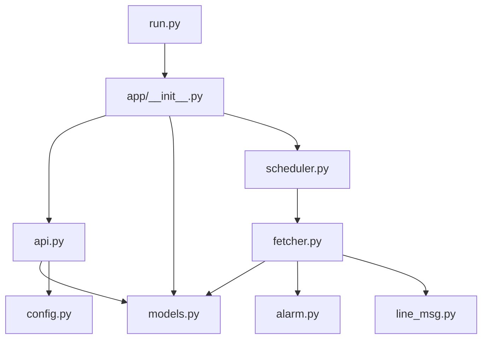

分析結果與模組拆分建議如下：

高層說明
- 原始檔案：[`server.py`](server.py:1)
- 主要功能區塊（來源行）：匯入（1-9）、設定/初始化（11-26）、工具（34-51）、模型（55-94）、資料建立（96-97）、抓取設定（99-115）、抓取邏輯（118-175）、排程（177-180）、API（183-224）、靜態頁面（229-231）、啟動（234-235）。
- 關鍵元素：[`FAILED_LOG_FILE`](server.py:30)、[`safe_float()`](server.py:34)、[`log_failed_record()`](server.py:42)、[`ShipAIS`](server.py:55)、[`urls`](server.py:99)、[`RECT`](server.py:107)、[`scraper`](server.py:115)、[`fetch_data()`](server.py:118)、[`scheduler`](server.py:177)、[`get_latest_data()`](server.py:183)、[`get_ship_history()`](server.py:197)、[`show_map()`](server.py:229)。外部相依檔：[`alarm.py`](alarm.py:1)、[`line_msg.py`](line_msg.py:1)、靜態檔案 [`static/ships_map.html`](static/ships_map.html:1)。

建議拆分檔案（每個檔案為單一責任）
1) [`app/__init__.py`](app/__init__.py:1)
   - 職責：建立 Flask app factory、初始化 extension（SQLAlchemy、CORS）。
   - 內容：將原本的 app 建立與 db 初始化（對應原 11-26、96-97）。
   - 輸出：create_app(config_object) 回傳 Flask app 與 db。

2) [`config.py`](config.py:1)
   - 職責：集中設定（DB URI、FAILED_LOG_FILE、RECT、urls、其他 env 讀取）。
   - 內容：原 18-21（DB path 建議改為由此組合）、30（FAILED_LOG_FILE）、99-105（`urls`）、107-113（`RECT`）。

3) [`models.py`](models.py:1)
   - 職責：放置 ORM 定義。
   - 內容：將 [`ShipAIS`](server.py:55) 與其 [`to_dict()`](server.py:75) 移入，並在模組中引用 app 的 db（或由 app factory 傳入）。

4) [`utils.py`](utils.py:1)
   - 職責：通用工具函式與小型 helper。
   - 內容：[`safe_float()`](server.py:34)、[`log_failed_record()`](server.py:42)、建立 cloudscraper 的 [`scraper`](server.py:115)（或在 fetcher 中建立）、以及 FAILED_LOG_FILE 相關處理（可從 [`config.py`](config.py:1) 讀設定）。

5) [`fetcher.py`](fetcher.py:1)
   - 職責：負責抓取邏輯與資料處理（含失敗紀錄、alarm 檢查、送 LINE）。
   - 內容：將 [`fetch_data()`](server.py:118) 的實作移入，使用 [`urls`](server.py:99)、[`RECT`](server.py:107)，使用 [`alarm.in_rectangle`](alarm.py:1) 與 [`line_msg.send_msg`](line_msg.py:1)。
   - 注意：需在函式以 app context 執行（或由 create_app 啟動時註冊 scheduler job）。

6) [`scheduler.py`](scheduler.py:1)
   - 職責：排程器啟動與管理。
   - 內容：建立 `BackgroundScheduler()`、註冊 [`fetch_data()`](server.py:118) job（原 177-180），並提供 start/stop 控制（方便測試）。

7) [`api.py`](api.py:1)
   - 職責：所有 Flask 路由/API。
   - 內容：將 [`get_latest_data()`](server.py:183)、[`get_ship_history()`](server.py:197)、[`show_map()`](server.py:229) 放入此檔，並從 models 與 config 取得所需資源。

8) [`run.py`](run.py:1)（或 `wsgi.py`）
   - 職責：啟動流程：create_app -> 啟動 scheduler -> 初次抓取 -> app.run（原 180, 234-235）。
   - 內容：main 入口，不放業務邏輯。

現有檔案維持
- [`alarm.py`](alarm.py:1)（保留，fetcher 呼叫）
- [`line_msg.py`](line_msg.py:1)（保留，fetcher 呼叫）
- [`static/ships_map.html`](static/ships_map.html:1)（靜態資源保留）

注意事項與實作細節
- 資料庫 db 與 models 的初始化
  - 建議在 [`app/__init__.py`](app/__init__.py:1) 中建立 db = SQLAlchemy()（延遲綁定），models import 不直接建立 db，但在 create_app 中呼叫 db.init_app(app) 並在需要時呼叫 db.create_all()（對應原 96-97）。
- app context
  - [`fetch_data()`](server.py:118) 需在 app.app_context() 下執行；可由 scheduler job wrapper 提供 context。
- 設定集中化
  - 所有可改參數（DB 路徑、RECT、urls、LINE_USER_ID、FAILED_LOG_FILE、抓取週期）應放到 [`config.py`](config.py:1) 或使用環境變數，方便測試與部署。
- 減少全域變數
  - 避免在多個檔案透過全域變數直接 import `app` 或 `db`，採 factory pattern 與依賴注入（簡單方式：在 create_app 中 import 並註冊 blueprint）。
- 測試與除錯
  - 將抓取/解析邏輯拆成更小的函式（parse_row 等），利於單元測試與錯誤記錄（目前有 [`log_failed_record()`](server.py:42)）。

模組關係（簡潔 Mermaid 圖示）

對應到原始程式碼的主要對照（便於搬移）
- 匯入與 app/init：原行 11-26 -> [`app/__init__.py`](app/__init__.py:1)
- 工具：原行 34-51 -> [`utils.py`](utils.py:1)
- ORM：原行 55-94 -> [`models.py`](models.py:1)
- urls/RECT/FAILED_LOG_FILE/scraper：原行 99-115 -> [`config.py`](config.py:1) + [`utils.py`](utils.py:1)
- fetch_data（含 alarm/line）：原行 118-175 -> [`fetcher.py`](fetcher.py:1)
- scheduler：原行 177-180 -> [`scheduler.py`](scheduler.py:1)
- API 路由：原行 182-231 -> [`api.py`](api.py:1)
- 啟動：原行 234-235 -> [`run.py`](run.py:1)

結論
- 按上述拆分可讓程式責任分離、易測試、易維護。下一步建議：我可以為你產生各新檔案的初始範本（含必要 import 與最小可執行骨架），或直接幫你將 [`server.py`](server.py:1) 拆分成上述檔案並提交 patch（請指定要我採取哪一個行動）。